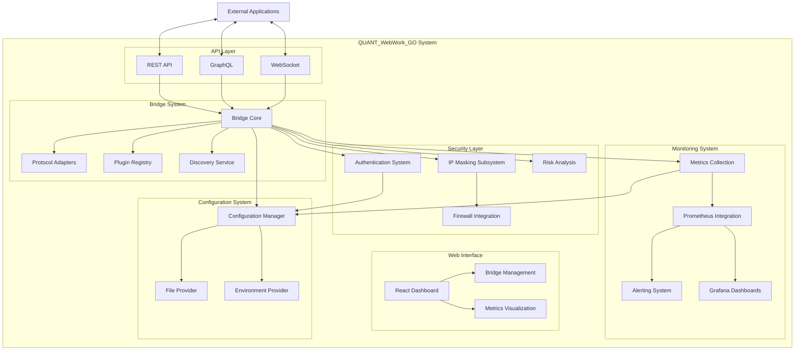

# QUANT_WebWork_GO System Architecture

## Overview

QUANT_WebWork_GO is a private network system designed to provide secure communication channels between services while maintaining privacy and offering comprehensive monitoring capabilities. This document outlines the overall architecture, core components, and the interactions between these components.

## System Goals

- Create a highly secure private network system
- Mask personal details and IP addresses
- Allow third-party access to applications and services
- Provide comprehensive monitoring of resources and network performance
- Implement an easy-to-use plug-and-play system for connecting projects
- Support multiple languages and frameworks
- Design for future adaptability

## Architecture Diagram

## Core Components

### API Layer

The API Layer serves as the primary interface for external applications to interact with the QUANT_WebWork_GO system. It provides multiple protocols for flexibility:

- **REST API**: Standard HTTP interface for conventional applications
- **GraphQL**: Flexible query language for clients requiring specific data
- **WebSocket**: Real-time communication for live updates and streaming

### Bridge System

The Bridge System is the core of QUANT_WebWork_GO, responsible for routing and transforming messages between different protocols and services:

- **Bridge Core**: Central message routing and transformation system
- **Protocol Adapters**: Connectors for different protocols (HTTP, gRPC, WebSockets, etc.)
- **Plugin Registry**: Registry for dynamically loading protocol adapters and handlers
- **Discovery Service**: Service discovery mechanism for detecting and registering new services

### Security Layer

The Security Layer implements comprehensive protection mechanisms:

- **Authentication System**: JWT-based authentication for API access
- **IP Masking Subsystem**: Hides and rotates IP addresses for privacy protection
- **Risk Analysis**: Evaluates incoming connections for potential security threats
- **Firewall Integration**: Rule-based traffic filtering and access control

### Monitoring System

The Monitoring System provides visibility into system performance and health:

- **Metrics Collection**: Collects system and application metrics
- **Prometheus Integration**: Stores time-series metrics data
- **Alerting System**: Notifies administrators of system issues
- **Grafana Dashboards**: Visualizes metrics and system health

### Web Interface

The Web Interface provides a user-friendly management console:

- **React Dashboard**: Central management console
- **Bridge Management**: Interface for configuring and monitoring bridges
- **Metrics Visualization**: Graphical representation of system metrics

### Configuration System

The Configuration System manages system settings and environment-specific configurations:

- **Configuration Manager**: Central configuration management
- **File Provider**: Loads configuration from files (YAML, JSON, TOML)
- **Environment Provider**: Loads configuration from environment variables

## System Interactions

The QUANT_WebWork_GO system operates as follows:

1. External applications connect to the system through the API Layer using REST, GraphQL, or WebSockets
2. Requests are authenticated by the Security Layer
3. The Bridge System routes messages to the appropriate services
4. The Monitoring System collects metrics on all operations
5. Administrators manage the system through the Web Interface
6. The Configuration System provides runtime configuration

## Security Design

Security is a fundamental aspect of QUANT_WebWork_GO:

- **Zero-Trust Model**: All connections are authenticated and authorized
- **IP Masking**: All client IP addresses are masked using a rotating scheme
- **Rate Limiting**: Prevents abuse of the system
- **Input Validation**: All inputs are validated before processing
- **Encrypted Storage**: Sensitive data is encrypted at rest
- **TLS**: All connections use TLS for transport security

## Scalability Considerations

The system is designed for horizontal scalability:

- Stateless components can be scaled horizontally
- Service discovery enables dynamic scaling
- Metrics collection identifies bottlenecks
- Configuration can be adjusted for different deployment scenarios

## Monitoring and Observability

The monitoring system provides:

- Real-time metrics on system performance
- Customizable dashboards for different stakeholders
- Alerting for proactive issue resolution
- Historical data for trend analysis
- Distributed tracing for request paths

## Future Extensibility

The QUANT_WebWork_GO architecture is designed for future extensibility:

- Plugin system allows adding new protocols without core changes
- Service discovery enables seamless integration of new services
- Configuration system supports environment-specific settings
- Modular design allows component replacement
